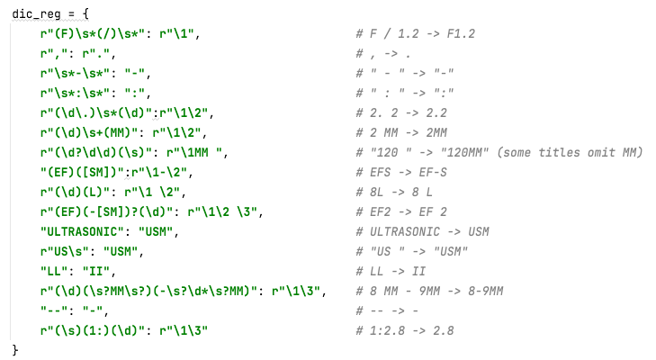
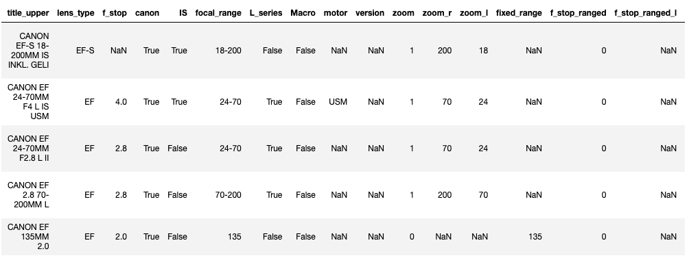
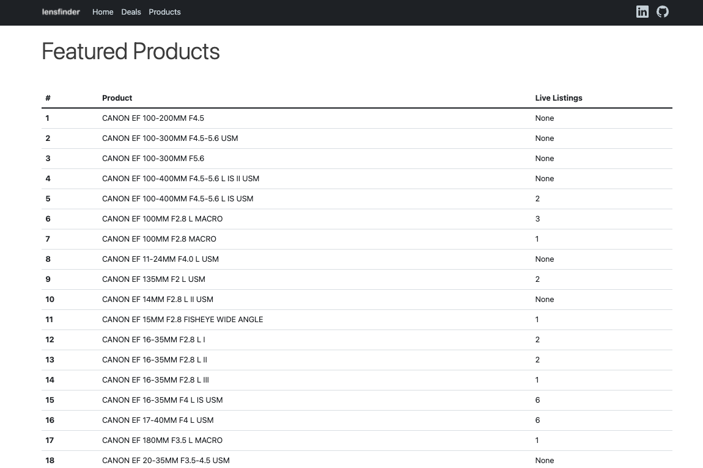

# lensfinder

## Table of contents
- Introduction
    - What is lensfinder?
    - Who is it for?
    - Why build this?
- How it all works
    - Operating model
    - Technologies used
    - Get the data
    - Transform the data
    - Visualize the data
    - Automate
- Appendix

## Introduction
### What is lensfinder?
lensfinder is a website that helps you find the best deals for Canon lenses on the Swiss second-hand market. 
The underlying compiled dataset generates the insights that enable you to make a buy or sell decision.

The solution offers three views:
- A snapshot of the best live listings
- A directory of Canon EF lenses currently or previously listed
- A product page per lens with historical prices and summary statistics

Take a look [here](http://lensfinder.herokuapp.com/home) (it can take a few seconds to load the first time as the server needs to exist sleep mode). 

### Who is it for?
Swiss-based photographers (myself included) are the main target for this app but professional sellers could also find it useful. The project itself can be of interest to fellow data scientists curious to see how end-to-end projects can be implemented. 

### Why build this?
As an avid photographer, I am often looking to upgrade or sell my lenses through second-hand websites. One of these is Ricardo, a major player in Switzerland. On an average day, you can expect to find 350 buy-now listings for Canon EF lenses. Over the course of 2021, I found myself buying multiple lenses, some of which I then sold for a profit after a couple months of use. Knowing there was money to be made (or at the very least saved) in this market, I decided to build a product to do just that.

## How it all works

### Operating model
The diagram below attempts to provide a high level abstraction of what is happening in the background. 
In essence, we scrape listings, classify them into unique products using a machine learning model, compute summary statistics per product and display the results. All this is run daily through orchestration modules.

*click the image for better resolution*

Code is executed sequentially via orchestration scripts
1. First, get the data : build a historical data set through web-scrapping and automation
2. Then, transform the data in order to classify listings into products and calculate summary statistics through data cleansing, feature engineering, labeling, modelling and summarization
3. Finally, visualize the data : display the results through building and hosting a web app

### Technologies used

**Languages**: The project is developed almost exclusively in Python 3. The web-app front-end uses HTML, CSS, JavaScript and leverages Bootstrap

**Modules**: Beautiful Soup and Selenium for web-scrapping, pandas and RegEx for data processing, scikit-learn for modelling, Flask, Jinja and Charts.js for the web-app

**Automation**: Launchd was used to run bash scripts at regular intervals on my local machine (MacBook air M1)

### Get the data

The data I scrape exists in two locations :
1. the search results for my query : Canon EF (buy now only)

2. the individual listing pages

I first request and save all the search results pages for the query (typically 6-7 pages with 50 listings per page). 
From these, I extract the links to all the individual listings pages (around 350 links).

I then request and save all the new individual listing pages (i.e. only those that are not already saved locally) and the listings pages on disk that need to be refreshed (i.e. if a listing past its end date is missing the information whether the product was sold or not).

For all the unique product listing pages I have locally, I scrape and save the listing name, description title and body, the product condition, the price, the listing end date and whether it sold or not.

### Transform the data

Now that we have a file containing the list of unique product listings, we need to link each one of them to product themselves. Typically, Ricardo and other second-hand-websites do not have a directory of products from which to choose from when putting up a listing. You therefore do not have the ability to identify whether different listings refer to the same product. We will use machine learning to bridge that gap.

Camera lens product names contain patterns we can use as features to train a classification algorithm on. Thankfully, listing titles usually mirror product names.

Before we move ahead however, let's remove listings that do not refer to canon EF lenses by using keyword matching.

Sellers write the listing titles in different ways, so we then harmonize them by doing search and replace with RegEx.

Once done, we now have cleaned up titles we can extract relevant features from. Once more, we use RegEx to perform this task. We end up with the following features.

This data frame is then used to label data in Excel.

Once we have labelled data, we can go ahead and train a machine learning model to match listings to products. Prior to feeding data to the model, I train and apply a label encoder on the features that can handle previously unseen entries in production data. I initially tested the accuracy of multiple classification algorithms using stratified k folds and across a grid of features. Given the limited number of samples (listings) and data involved, I ended up using a Naive Bayes Classifier as it gave me the best performance against accuracy (I chose this evaluation metric as false negatives and positives are equally detrimental in this classification exercise) using 10 of the initial 17 features. The accuracy obtained was around 80-90% on test data which is satisfactory for the task at hand.

Our data frame now equipped with predictions, it is time to calculate our summary statistics. We do this by applying a few data frame manipulation actions. A sample  of the resulting summary data frame follows.

### Visualize the data

With the summary data at hand, we now need a solution for users to interact with the data. A responsive web-app presents the benefits of being easily accessible via mobile or desktop.

We use Flask, the micro web framework to build the routes to our different pages we feed with data dynamically via Jinja. Bootstrap is used to help beautify the website. 

Visitors to the site are presented with the following page. From there you are invited to either explore the deals or to look at specific product details through the directory.

The deals page shows live listings that meet the following product criteria below :
- priced at least CHF 50 under the historical maximum price of successful listings
- priced at least CHF 30 under the historical minimum price of unsuccessful listings
- priced no more than CHF 100 over the historical average price of successful listings

Clicking on a product sends you to the listing.

The directory page displays the unique products that have appeared in listings (since I started scrapping) in alphabetical order. The number of live listings per product is also displayed.
Clicking on a product leads to its dedicated product page.

The product page contains summary stats for successful and unsuccessful listings of the product, a graphic showing the prices of successful, unsuccessful and live listings.

Live listings have their own table. Clicking on an entry sends you to the listing (NB: you might see wrongly listed products here, that is expected as the classification algorithm gives 80-90% accuracy - the table serves as a sense check).

The app directory is available on GitHub. Heroku, fetches the files and creates a build with each new commit to the main branch.

### Automate

Automation plays a central part in ensuring data quality and eliminating the manual effort needed to update the app's data. The first piece of automation implemented was to ensure scrapping jobs were running every day. I added a preference file to the launch_agent folder on my local machine that runs a bash script daily. This script runs the orchestration file that initiates the data pipeline (see the "How this works" diagram) and commits the summary data frame to the main branch, thereby starting a new build by Heroku. Whether the orchestration sequence runs successfully or not, I get an email. I usually only get a failed job if I am not connected to the internet, or my laptop is closed during selenium calls. 

## Appendix

By building this app, I wanted to highlight and further my software engineering and data science skills. The result is a proof of concept. There are many items I could see being improved. Do feel free to reach out via [LinkedIn](https://www.linkedin.com/in/antoinejlrousseau/) if you have any questions or are curious to learn more about this project. I love a good engineering conversation!

